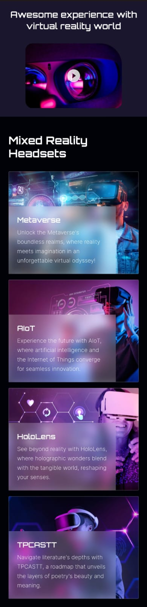
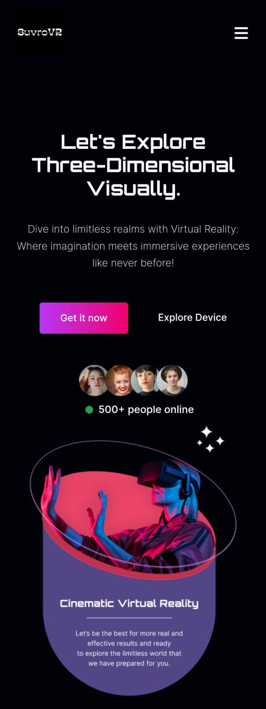
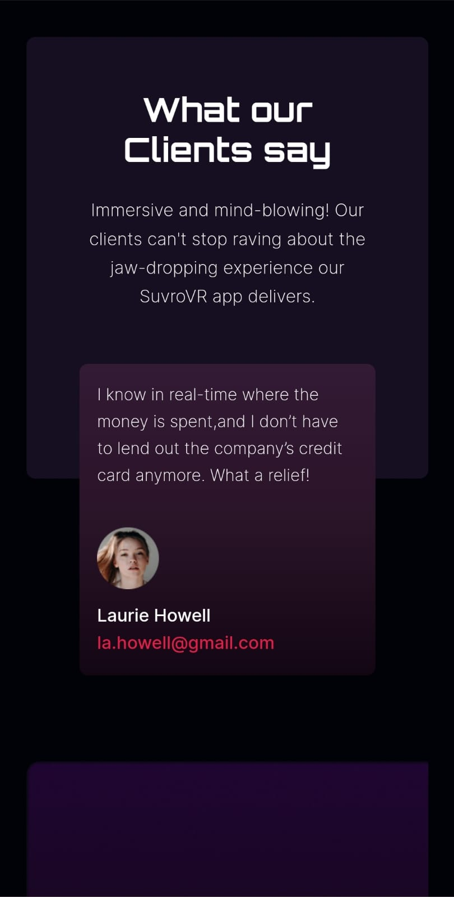
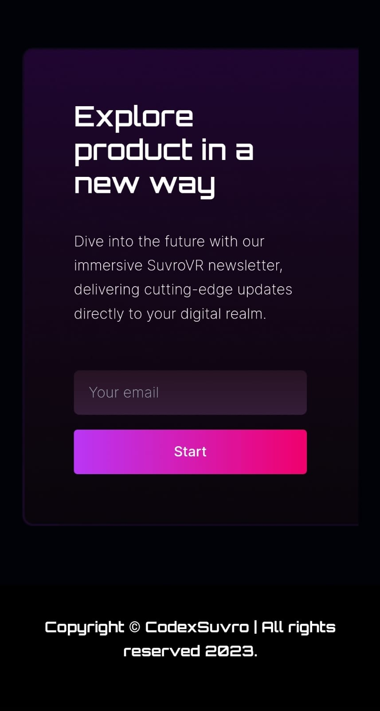

# SuvroVR - Virtual Reality Application

SuvroVR is a cutting-edge virtual reality application built using React, Tailwind CSS, and Aos animations. Immerse yourself in stunning virtual environments and experience a new dimension of interactivity and immersion.

  






## App Link 

- **https://codexsuvro-vr.netlify.app**

## Features

- **Immersive VR Environments**: Step into a variety of breathtaking virtual environments that transport you to different worlds.

- **Smooth Interactions**: Navigate through the VR spaces with intuitive controls and responsive interactions, making your experience seamless and enjoyable.

- **Aos Animations**: Enjoy eye-catching animations powered by Aos (Animate on Scroll) library, adding an extra layer of visual appeal to the VR experience.

- **Customization**: Tailor the VR environment to your preferences. Choose from a range of settings and themes to create your ideal virtual space.

## Getting Started

Follow these steps to get SuvroVR up and running on your local machine:

1. **Clone the repository**:

   ```bash
   git clone https://github.com/yourusername/suvrovr.git
   ```

2. **Navigate to the project directory**:

   ```bash
   cd suvrovr
   ```

3. **Install dependencies**:

   ```bash
   npm install
   ```

4. **Run the application**:

   ```bash
   npm start
   ```

5. **Open your browser**:

   Visit `http://localhost:3000` to experience SuvroVR in all its virtual glory!

## Dependencies

- React
- React VR
- Tailwind CSS
- Aos (Animate on Scroll) Library

## Contributing

We welcome contributions from the community! If you'd like to contribute to SuvroVR, please follow these steps:

1. Fork the repository.

2. Create a new branch for your feature or bug fix:

   ```bash
   git checkout -b feature/your-feature-name
   ```

3. Make your changes and commit them:

   ```bash
   git commit -m "Add your commit message here"
   ```

4. Push your changes to your forked repository:

   ```bash
   git push origin feature/your-feature-name
   ```

5. Create a pull request detailing your changes. We'll review it and work together to merge it into the main codebase.


---

Experience the future of virtual reality with SuvroVR. Dive into immersive environments, explore stunning visuals, and interact with the virtual world like never before. Feel free to reach out to us at suvrovr@example.com for any inquiries or support.

*This README.md template was generated by [ChatGPT](https://github.com/openai/chatgpt) - Version 3.5. The information provided in this document is fictional and for demonstration purposes only.*
